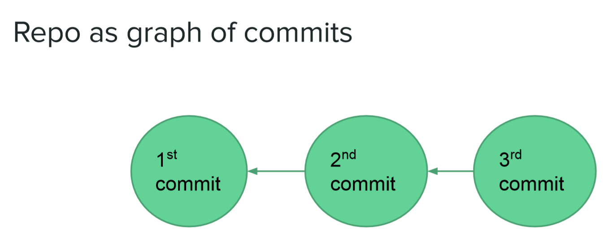

# Version Control: Git

Goals of VCS

* Organize a set of files \(repository/repo\)
* Record changes to collection of files in repo over time, known as “commits”
* Turn back time - see state of repo at particular point in past
* Support a software developer’s workflow

Solution - Distributed VCS \(e.g., Git\)

* No single “official” repository
* Repositories can be **cloned** by any user
  * Everyone has the **complete history** of the repo
* Changes \(commits\) can be **pushed/pulled between repositories**
  * No need to check with any ‘central’ repo
* Every commit is a **snapshot of the filesystem**
* A repo is a **graph of commits**

Advantages Of DVCS

* Allow you to maintain multiple versions of the same codebase \(and they can be local\)
* Work offline and push changes later \(e.g.: Working on an airplane\)
* Control over commit history, which documents the evolution of your system

### Git

Git Commits = Snapshots

* Each commit is a snapshot of the full codebase
  * That’s the abstraction. Under the hood, Git stores differences \(to optimize space usage\)
* Git repo \(repository\) is a graph of commits
  * A version of the code is a node in the graph
  * History is described by paths in the graph

Working Locally

1. Working directory: The actual files on your machine
2. Staging Area \(aka index\) Intermediate storage for code changes
3. Repository \(aka history\) The graph of commits

Why the extra step?

* The extra step \(i.e., staging, before committing\) gives us more granularity
  * Choose which changes you want to commit \(e.g. Do not commit temporary changes made only for the purpose of local testing\)
* When saving changes, can break them into multiple commits. Each commit should have its own concise, meaningful message
  * Goal: Work in a traceable manner
* Warning: It is essential to do them all in order

Basic Git Commands

* init
  * Usage: `git init [repository name]`

    This command is used to start a new repository
* status
  * Usage: `git status`  

    This command lists all the files that have to be committed
* add
  * Usage: `git add [file]`  

    This command adds a file to the staging area
* commit
  * Usage: `git commit -m “[ Type in the commit message]”`  

    This command records or snapshots the file permanently in the version history
* log
  * Usage: `git log`  

    This command is used to list the version history for the current branch

